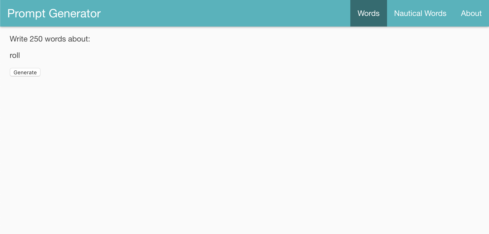

# Preact Writing Prompt Generator

Stuck on what to write? Try this simple writing prompt generator!

Preact Writing Prompt Generator is a single page Preact app where users can generate writing prompts from multiple lists of words (currently a general set of random words or a set of nautical terms).

This is the Preact version of my React prompt generator, which can be found [here](https://github.com/sharkham/prompt-generator) and tried out [here](https://promptgenerator.netlify.app/).

## Installation

1. Fork the repository
2. Clone the files to your computer
3. Navigate to `/preact-writing-prompt-generator` in your terminal
4. Run `npm install`
5. Run `npm run dev`. This will generate a link to open the development version of the app!

## Usage Example

## Contributing
Pull requests are welcome. For major changes, please open an issue first to discuss what you would like to change.

## License
[MIT](https://choosealicense.com/licenses/mit/)
